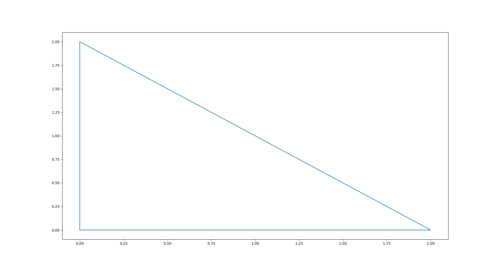

# Sheet 8 [Video](https://drive.google.com/file/d/1WxmDC4_Qw4qLRN0bo-yG6MUdVZ1u4aUy/view?usp=sharing)

```
Notes:

importing plt
multiple plt.plot
what does plt.show do?
```

1. Make sure that `matplotlib` module is installed on your device, and show its version.

<details>
    <summary>Answer</summary>

```python
import matplotlib

print(matplotlib.__version__)
```
</details>

2. Using `pyplot` draw a line from (2,2) to (4, 5).

<details>
    <summary>Answer</summary>

```python
import matplotlib.pyplot as plt
import numpy as np

a = np.array([2, 4])
b = np.array([2, 5])

plt.plot(a, b)

plt.show()
```
</details>

3. What is the output of the following code:


```python
import matplotlib.pyplot as plt
import numpy as np

a = np.array([0, 2, 4])
b = np.array([0, 2, 0])

plt.plot(a, b)

plt.show()
```

4. Write code that draw the following graph 

<details>
    <summary>Answer</summary>

```python
import matplotlib.pyplot as plt
import numpy as np

a = np.array([0, 0, 2, 0])
b = np.array([0, 2, 0, 0])

plt.plot(a, b)

plt.show()

```
</details>


5. Try out different modes such as dashed line, points.
Use `marker`, `linestyle` and format string

```python
import matplotlib.pyplot as plt
import numpy as np

a = np.array([0, 2, 4])
b = np.array([0, 2, 0])

plt.plot(a, b)

plt.show()
```

6. Draw two lines, (0,0) to (2,2) and (2,2) to (3,5).
The first with width 10 and blue.
The other is red.

<details>
    <summary>Answer</summary>

```python
import matplotlib.pyplot as plt

plt.plot([0, 2], [0, 2], c='r', linewidth=10)
plt.plot([2, 3], [2, 5], c='b')

plt.show()
```
</details>      

7. Write code that draw the following graph.


<details>
    <summary>Answer</summary>

```python
import matplotlib.pyplot as plt
import numpy as np

a = np.array([3, 6, 1, 8])

plt.plot(a, marker="o", linestyle="-.")
plt.xlabel("X")
plt.ylabel("Y")
plt.title("My Graph")
plt.grid(True)

plt.show()
```
</details>

8. What is the output of the following code: 

```python

import matplotlib.pyplot as plt
import numpy as np

# plot 1:
x = np.array([0, 1, 2, 3])
y = np.array([3, 8, 1, 10])
plt.subplot(1, 2, 1)
plt.plot(x, y)

# plot 2:
x = np.array([0, 1, 2, 3])
y = np.array([10, 20, 30, 40])
plt.subplot(1, 2, 2)
plt.plot(x, y)
plt.show()
```

9. Scatter:


```python
import matplotlib.pyplot as plt
import numpy as np

x = np.array([5, 7, 8, 7, 2, 17, 2, 9, 4, 11, 12, 9, 6])
y = np.array([99, 86, 87, 88, 111, 86, 103, 87, 94, 78, 77, 85, 86])
plt.scatter(x, y)
plt.show()
```

```python
import matplotlib.pyplot as plt
import numpy as np

x = np.array([5, 7, 8, 7, 2, 17, 2, 9, 4, 11, 12, 9, 6])
y = np.array([99, 86, 87, 88, 111, 86, 103, 87, 94, 78, 77, 85, 86])
colors = np.array([0, 10, 20, 30, 40, 45, 50, 55, 60, 70, 80, 90, 100])
plt.scatter(x, y, c=colors, cmap="plasma")
plt.colorbar()
plt.show()
```

```python
import matplotlib.pyplot as plt
import numpy as np

x = np.array([5, 7, 8, 7, 2, 17, 2, 9, 4, 11, 12, 9, 6])
y = np.array([99, 86, 87, 88, 111, 86, 103, 87, 94, 78, 77, 85, 86])
sizes = np.array([20, 50, 100, 200, 500, 1000, 60, 90, 10, 300, 600, 800, 75])
plt.scatter(x, y, s=sizes)
plt.show()
```

10. Draw two figures one with virtical bars and one with horizontal bars.

```python
import matplotlib.pyplot as plt
import numpy as np

x = np.array(["A", "B", "C", "D"])
y = np.array([3, 8, 1, 10])

# your code goes here

plt.show()
```

<details>
    <summary>Answer</summary>

```python
import matplotlib.pyplot as plt
import numpy as np

x = np.array(["A", "B", "C", "D"])
y = np.array([3, 8, 1, 10])

plt.subplot(2, 1, 1)
plt.bar(x, y)

plt.subplot(2, 1, 2)
plt.barh(x, y)
plt.show()
```
</details>

11. Histogram:


```python
import matplotlib.pyplot as plt

x = [1, 2, 3, 4, 4, 1, 4, 4, 2, 1, 4, 1, 1, 1, 1]

print([x.count(c) for c in set(x)])

plt.hist(x)
plt.show()
```

12. Pie Chart:


```python
import matplotlib.pyplot as plt
import numpy as np

percentages = np.array([1, 1, 1, 1])

mylabels = ["Apples", "Bananas", "Cherries", "Dates"]
plt.pie(percentages, labels=mylabels)
plt.show()
```
