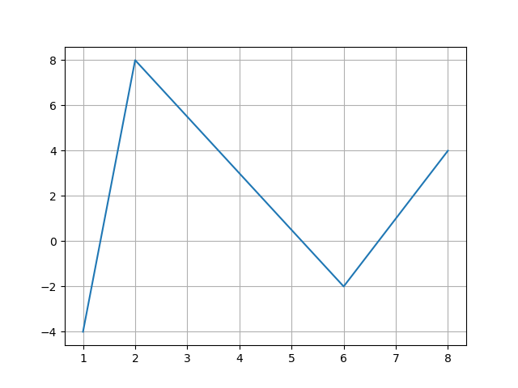

# Final 2024

## Question 1
Trace the following segment of code and show the outputs. **(3 points each)**


```python
numbers = [12, 75, 150, 180, 145, 525, 50]

for num in numbers:
    if num > 500:
        break
    if num > 150:
        continue
    # check if number is divisible by 5
    if num % 5 == 0:
        print(item)
```

```python
n = 5
k = 5
for i in range(0, n+1):
    for j in range(k-1, 0, -1):
        print(j, end="")
    print()
```

```python
sample_dict = {
    "name": "Kelly",
    "age": 25,
    "salary": 8000,
    "city": "New york"
}
keys = ["name", "salary"]
res = dict()
for k in keys:
    res.update({k: sample_dict[k]})
print(res)
```

```python
sampleArray = numpy.array([
    [ 3,  6,  9, 12],
    [15, 18, 21, 24],
    [27, 30, 33, 36],
    [39, 42, 45, 48],
    [51, 54, 57, 60]])
print("Printing Input Array")
prin(sampleArray)
newArray = sampleArray[::2, 1::2]
print(newArray)
```

```python
L = [20, 10, 30, 0]

for i in range(4):
    for j in range(i+1, 4):
        if(L[i] > L[j]):
            L[i], L[j] = L[j], L[i]
print(L)
```

```python
def fun(num):
    if num:
        return num + addition(num - 1)
    else:
        return 0

res = fun(4)
print(res)
```

```python
num1, num2 = 0, 1
for i in range(10):
    print(num1, end=" ")
    res = num1 + num2
    num1 = num2
    num2 = res
```

---

## Question 2

1. Make a `ndarray` of `5` rows and `4` columns and initialize it with `ones`.

2. Assume you have array A of shape `(3,4,5)` we want to transpose the first to new shape `(3,5,4)`

3. Shuffle the `ndarray A`. the shuffling should happen to the same array.

4. Make identity matrix `I` of `4x4` using `NumPy`.

5. Delete the last item in list `L`.

6. Split the `NumPy` base on `rows` to `4` arrays.

7. Remove all `whitespaces` on the left and right of the string variable called `Name`.

8. Capitalize the first letter of each word in a string variable called `Name`.

9. Divide two numpy array `arr1` and `arr2` element by element.

10. Change shape of numpy array `arr` to be `12` rows and `3` columns.


---

## Question 3

1. Open a file called `data.txt` to write a dictionary `(dict)` content using `Json` Library.

2. Plot the following diagram.


3. Plot pie chart with this values male 55 and female 45

4. Insert Value into dictionary `DICT` by first read key from user, if key doesn't exist read the value from user and insert the pair into `Dict`, if key is already exist print error messge.

5. Make a `ndarray` of `1000` elements and initialize it with `random integers` between `-50`, `50` then plot `histogram` for the generated data.
